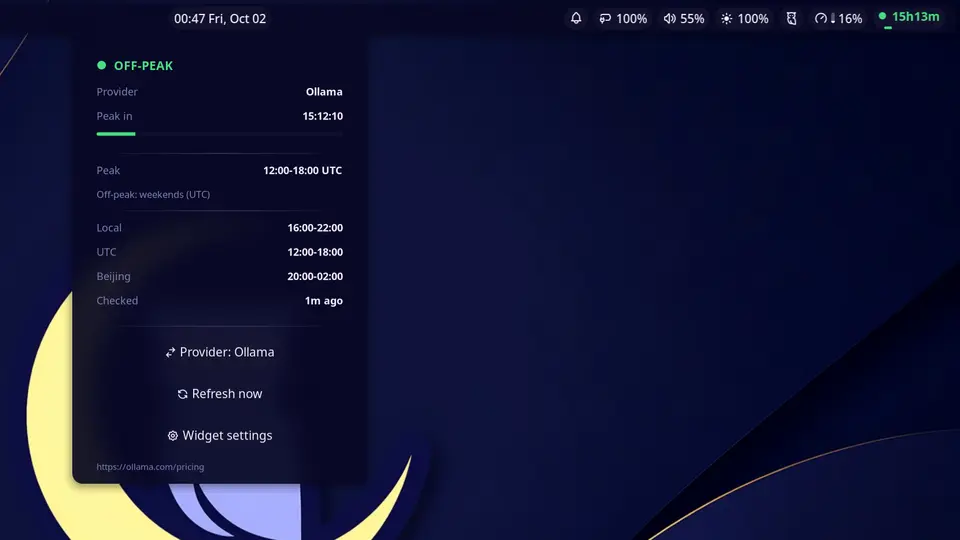

# DeepSeek Peak Hours — Noctalia Bar Widget

A [Noctalia](https://github.com/noctalia-dev/noctalia) bar widget that shows
whether API calls are billed at **peak** (2× price) or **off-peak** (half
price) rates, with a live countdown and progress gauge for the current rate
block. Works for **DeepSeek** and for the **DeepSeek models on Ollama Cloud**,
which use different peak windows. Built for Niri and any other compositor
Noctalia supports.

- 🟢 **Off-peak** — cheap: green dot.
- 🔴 **Peak** — 2× cost: red dot.
- 🟡 **Policy drift** — the official pricing page no longer matches the bundled
  schedule: amber dot and a notice.
- Live countdown and a progress bar for the current block; the info panel
  switches provider, refreshes the policy check, and opens settings.



## Peak windows

| Provider | Peak (UTC, Mon–Fri) | Off-peak |
|---|---|---|
| **DeepSeek** | 01:00–04:00 and 06:00–10:00 | everything else; weekends and Chinese public holidays all day (Beijing calendar) |
| **Ollama** (DeepSeek models) | 12:00–18:00 | everything else; weekends all day (UTC) |

Off-peak is half the peak price. Sources:
<https://api-docs.deepseek.com/quick_start/pricing/> ·
<https://ollama.com/pricing>

Chinese public holidays are bundled from
[NateScarlet/holiday-cn](https://github.com/NateScarlet/holiday-cn) (MIT, see
[THIRD_PARTY_NOTICES.md](THIRD_PARTY_NOTICES.md)) and refreshed yearly.
DeepSeek's Ollama-hosted models and other Ollama models may have flat pricing;
the widget tracks the DeepSeek rate card.

## Install (Noctalia v5 — current)

The plugin is published in the Noctalia community plugin store. In Noctalia:

1. **Settings → Plugins** → find **DeepSeek Peak Hours** (source `community`)
   and enable it.
2. **Settings → Bar** → add the widget.

Or from the command line:

```sh
noctalia msg plugins enable alpzy/deepseek-peak
noctalia msg panel-toggle alpzy/deepseek-peak:panel
```

## Install (Noctalia v4 — legacy)

Noctalia v4 (Quickshell) is no longer maintained upstream, but this repository
keeps its implementation working:

```bash
git clone https://github.com/Alpzy/noctalia-deepseek-peak
cp -r noctalia-deepseek-peak/deepseek-peak ~/.config/noctalia/plugins/
```

Register the plugin in `~/.config/noctalia/plugins.json` (required — plugins
are not auto-discovered):

```json
"states": {
    "deepseek-peak": { "enabled": true, "sourceUrl": "local" }
}
```

Restart the shell, then enable it in Settings → Plugins and add it in
Settings → Bar.

## Configure

Settings → Plugins → DeepSeek Peak Hours → Configure: **provider**
(DeepSeek / Ollama), display mode (`compact` / `icon` / `full`), colours
(theme role or custom hex), tooltip, and the optional policy check (interval,
custom source, offline-only). The v5 panel also switches provider directly.

## Behaviour

- **Offline-first.** Schedules and Chinese holidays are bundled; the optional
  online check only compares the published peak windows and warns when they
  change. A failed check leaves the last known state in place.
- **No API key, no request metering.** It only reads public pricing pages.
- **23 languages** on v4; the v5 store translations are managed through
  [Noctalia Translate](https://i18n.noctalia.dev).

## Development

See [docs/DEVELOPMENT.md](docs/DEVELOPMENT.md) for architecture, tests, the
offscreen UI harness, and the hot-reload workflow. AI agents should read
[AGENTS.md](AGENTS.md).

The repository carries both implementations: the v4 QML plugin and the v5
Luau plugin (`deepseek-peak/plugin.toml`, `widget.luau`, `panel.luau`,
`checker.luau`, `lib/`). `tools/build_submission.py` produces the lean v5 tree
for the community plugin store.

## License

MIT — see [LICENSE](LICENSE).
