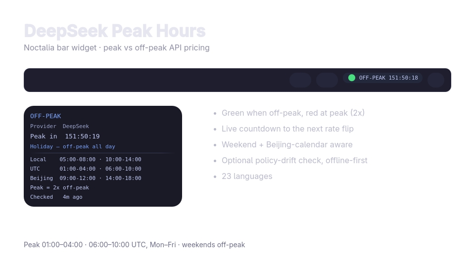

# DeepSeek Peak Hours — Noctalia Bar Widget

A [Noctalia](https://github.com/noctalia-dev/noctalia) bar widget that shows
whether API calls are billed at **peak** (2× price) or **off-peak** (half
price) rates, with a live countdown to the next rate flip. Works for
**DeepSeek** and for the **DeepSeek models on Ollama Cloud**, which use
different peak windows. Built for Niri and any other compositor Noctalia
supports.

- 🟢 **Off-peak** — cheap: green dot.
- 🔴 **Peak** — 2× cost: red dot.
- 🟡 **Policy drift** — the official pricing page no longer matches the bundled
  schedule: amber dot and a notice.
- Live `HH:MM:SS` countdown to the next flip; right-click swaps provider.



## Peak windows

| Provider | Peak (UTC, Mon–Fri) | Off-peak |
|---|---|---|
| **DeepSeek** | 01:00–04:00 and 06:00–10:00 | everything else; weekends and Chinese public holidays all day (Beijing calendar) |
| **Ollama** (DeepSeek models) | 12:00–18:00 | everything else; weekends all day (UTC) |

Off-peak is half the peak price. Sources:
<https://api-docs.deepseek.com/quick_start/pricing/> ·
<https://ollama.com/pricing>

Chinese public holidays are bundled from
[NateScarlet/holiday-cn](https://github.com/NateScarlet/holiday-cn) (MIT, see
[THIRD_PARTY_NOTICES.md](THIRD_PARTY_NOTICES.md)) and refreshed yearly.
DeepSeek's Ollama-hosted models and other Ollama models may have flat pricing;
the widget tracks the DeepSeek rate card.

## Install (Noctalia v4)

```bash
git clone https://github.com/Alpzy/noctalia-deepseek-peak
cp -r noctalia-deepseek-peak/deepseek-peak ~/.config/noctalia/plugins/
```

Register the plugin in `~/.config/noctalia/plugins.json` (required — plugins
are not auto-discovered):

```json
"states": {
    "deepseek-peak": { "enabled": true, "sourceUrl": "local" }
}
```

Restart the shell, then:

1. Settings → Plugins → enable **DeepSeek Peak Hours**.
2. Settings → Bar → add the **DeepSeek Peak Hours** widget.

## Configure

Settings → Plugins → DeepSeek Peak Hours → Configure: **provider**
(DeepSeek / Ollama), display mode (`compact` / `icon` / `full`), colours,
tooltip, and the optional policy check (interval, custom source, offline-only).
Right-clicking the widget swaps provider directly.

## Behaviour

- **Offline-first.** Schedules are bundled; the optional online check only
  compares the published peak windows and warns when they change. A failed
  check leaves the last known state in place.
- **No API key, no request metering.** It only reads public pricing pages.
- **23 languages**, following Noctalia's supported locale list.

## Development

See [docs/DEVELOPMENT.md](docs/DEVELOPMENT.md) for architecture, tests, the
offscreen UI harness, and the hot-reload workflow. AI agents should read
[AGENTS.md](AGENTS.md).

The v5 Luau port in `deepseek-peak/` is experimental and not published.

## License

MIT — see [LICENSE](LICENSE).
