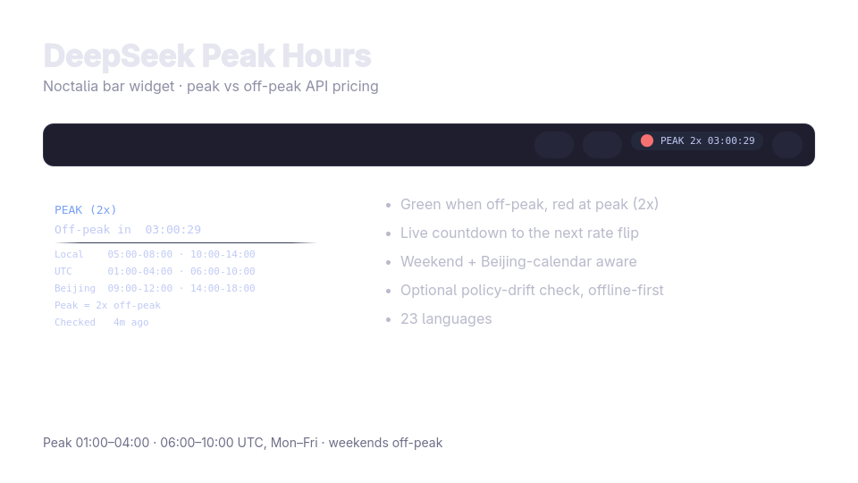

# DeepSeek Peak Hours

A Noctalia bar widget showing DeepSeek's peak/off-peak API pricing state:
green during off-peak (cheap), red during peak (2x), with a live countdown to
the next rate flip. Clicking opens a small info panel with today's windows in
local, UTC and Beijing time.

- Peak: **01:00–04:00** and **06:00–10:00 UTC**, Monday–Friday.
- Off-peak: everything else, at half the peak price.
- Weekend: off-peak all day, anchored to the Beijing calendar.
- Amber: the official pricing policy may have changed (optional online check).



## Install (Noctalia v4)

```bash
cp -r deepseek-peak ~/.config/noctalia/plugins/
```

Add the plugin to `~/.config/noctalia/plugins.json` (required — plugins are
not auto-discovered):

```json
"states": {
    "deepseek-peak": { "enabled": true, "sourceUrl": "local" }
}
```

Then enable it in Settings → Plugins and add it in Settings → Bar.

## Configure

Settings → Plugins → DeepSeek Peak Hours → Configure:

- display mode: `compact` (dot + countdown), `icon`, `full`
- off-peak / peak / drift colours
- tooltip on hover
- weekend anchoring (`beijing-anchored` or `utc`)
- optional policy check: enable/disable, interval, custom source URL, offline-only

## Notes

- Works offline: the schedule is bundled; the online check only adds the amber
  drift warning and never blanks the widget.
- 23 languages, following Noctalia's supported locale list.
- The v5 Luau port in this directory is **experimental and untested**; do not
  publish it yet.

## License

MIT
